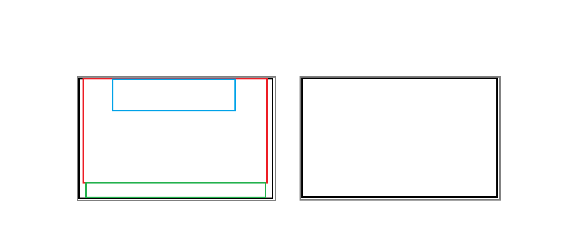

# Pannelli Swing
Il MainFrame contiene una gerarchia di pannelli

- **Grigio**: mainPanel
- **Nero**: gamePanel (sinistra), menuPanel (destra)
- **Rosso**: gameScreenPanel
- **Verde**: inventoryPanel
- **Azzurro**: textBarPanel